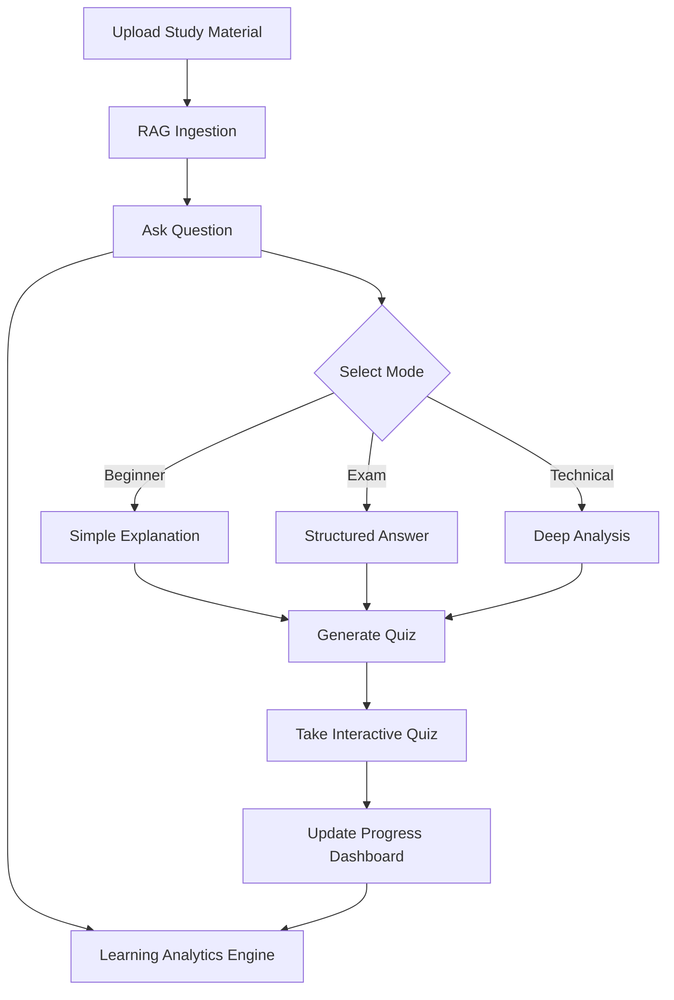
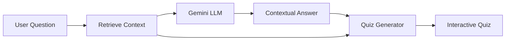

# AI Teaching Assistant - Smart Learning Platform

A production-quality **Retrieval-Augmented Generation (RAG)** platform for academic excellence. Upload course materials, ask questions in multiple explanation modes, take custom quizzes, and track your learning progress through a comprehensive dashboard.

---

## 🌟 Features & Tech Stack

### 1. Document Ingestion & OCR
Automatically extract text from native PDFs and scanned images.
- **Tech Stack**: FastAPI, `pypdf`, `pdf2image` (Poppler), **Tesseract OCR**, OpenCV, Pillow.
- **Capabilities**: Adaptive thresholding, deskewing, and noise reduction for low-quality scans.

### 2. Context-Grounded RAG
Ask questions against your uploaded materials with zero hallucinations.
- **Tech Stack**: **ChromaDB** (Vector Store), `sentence-transformers/all-MiniLM-L6-v2` (Embeddings), **Gemini API** (LLM), LangChain.
- **Capabilities**: Similarity search with L2 distance filtering and source-cited responses.

### 3. Smart Explanation Modes
Adapt the AI's teaching style to your current needs.
- **Tech Stack**: Gemini API, Custom Prompt Engineering (`prompt_modes.py`).
- **Modes**:
    - **Beginner**: Simple language and real-life analogies.
    - **Exam**: Structured, academic responses with bullet points.
    - **Technical**: In-depth analysis with advanced terminology and LaTeX.

### 4. Interactive Quiz Generation
Test your knowledge with auto-generated assessments.
- **Tech Stack**: Gemini API (Structured JSON), Vanilla JS (Interactive UI).
- **Types**: MCQs, True/False, and Short Answer questions with instant feedback and explanations.

### 5. Learning Progress Dashboard
Visualize your academic growth and topic mastery.
- **Tech Stack**: Local JSON-based analytics (`progress_tracker.py`), CSS Grid/Flexbox (Visualization).
- **Metrics**: Topic mastery bars, quiz score averages, and engagement timelines.

### 6. Attention Monitoring
Track engagement during study sessions via webcam.
- **Tech Stack**: **OpenCV** (Haar Cascade face detection), Browser MediaDevices API.
- **Output**: Real-time attention scores and session engagement reports.

---

## 🛠️ Overall Tech Stack Summary

| Layer | Technology |
|---|---|
| **Backend** | FastAPI, Uvicorn |
| **LLM** | Google Gemini (Multi-model fallback) |
| **Embeddings** | HuggingFace `all-MiniLM-L6-v2` |
| **Vector Store** | ChromaDB |
| **OCR** | Tesseract + OpenCV |
| **PDF Processing** | pypdf + pdf2image |
| **Analytics** | Local JSON File Storage |
| **Frontend** | HTML5, CSS3 (Vanilla), JS (ES6+), MathJax, Marked.js |

---

## 📐 Architecture

### Smart Learning Flow


### RAG + Quiz Pipeline


---

## 🚀 Getting Started

### Installation
1. **Clone & Setup Environment**:
   ```bash
   git clone <repo-url>
   cd AI_TEACHING_ASSISTANT-main
   python -m venv .venv
   source .venv/bin/activate  # Windows: .venv\Scripts\activate
   pip install -r requirements.txt
   ```

2. **Configure Environment Variables**:
   Copy `.env.example` to `.env` and add your `GEMINI_API_KEYS`.

3. **External Dependencies**:
   - Install **Tesseract OCR** for image text extraction.
   - Install **Poppler** for scanned PDF processing.

### Running the Platform
```bash
python run.py
```
Access the UI at: `http://127.0.0.1:8000/static/index.html`

---

## 🧪 Testing
The project includes a comprehensive suite of 28 unit and integration tests.
```bash
python -m pytest tests/ -v
```

---

## 📝 License
Developed as part of a Final Year Project (FYP).
